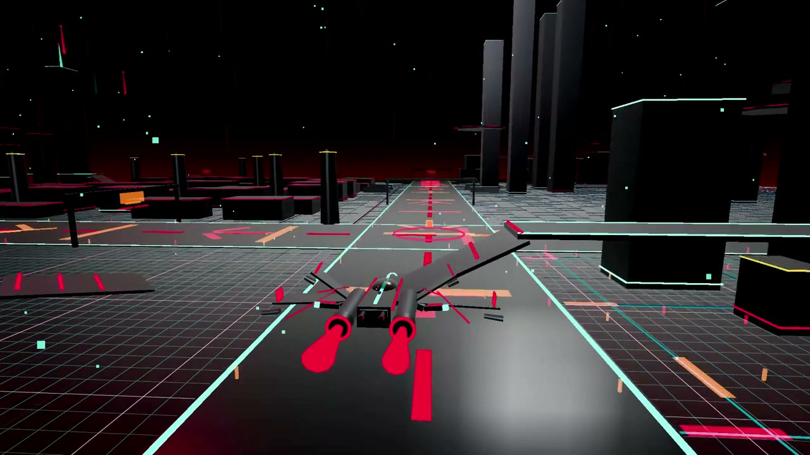

# Sadman — Worlds, interfaces & systems

A media-first portfolio for Md. Sadman Bin Masud: actual game recordings, application screenshots and a searchable public-project directory.

**[Open the portfolio](https://mdsadman2004.github.io/)** · **[GitHub profile](https://github.com/MdSadman2004)**



## Explore

- **Grid Protocol:** driving and flight recordings with native playback controls. Captured from the local prototype with scripted inputs and showcase cameras, not a human playthrough.
- **Sadman's Parable:** selectable garden, observatory and office environment captures, with a separate link to the playable browser game.
- **Diecast Dhaka:** desktop storefront, product-inspection dialog and mobile first viewport. A demonstration store with illustrative vehicle silhouettes, not a live shop.
- **Atlas:** a real historical Android configuration screen, framed in an editorial spread. A configured goal is not proof of successful background execution.
- **Directory:** searchable project names/descriptions, with category filters. All public repositories from the publication inventory are included.

## Run locally

The showcase itself is static HTML, CSS and JavaScript. No API key, database or build step is required.

```bash
python -m http.server 8090 --bind 127.0.0.1
```

Open `http://127.0.0.1:8090/`. This serves the portfolio, not the separately linked applications.

## Source guide

| File | Purpose |
| :-- | :-- |
| [index.html](index.html) | Editorial showcase and full project directory |
| [showcase.css](docs/showcase/showcase.css) | Warm-paper layout, responsive rules and accessible focus states |
| [showcase.js](docs/showcase/showcase.js) | Scene selector, directory filters and deliberate video playback |
| [Media notes](docs/showcase/README.md) | Capture provenance, staging and evidence boundaries |

Playback starts only when the visitor chooses it. No autoplay or unsolicited audio. Links, screenshots and native video controls remain available without JavaScript; filtering and the scene selector are progressive enhancements. Lower-page screenshots load lazily; videos use poster frames and do not preload their full files.

## Scope & limitations

This site presents existing project evidence, not a fresh test campaign or a claim that every project is production-ready. Runtime captures may predate later source changes. The directory is a publication snapshot, not a live GitHub API feed. This refresh preserves legacy pages, source files and existing notices. Browser visual QA for this refresh was blocked by an unverified browser-profile owner; file, media-decode, interaction-logic and publication checks do not substitute for a fresh desktop/mobile render check.

## Credits and reuse

Project-specific credits, affiliations and license terms are documented in the linked repositories. The portfolio's existing Libre Caslon Display and Manrope font files retain their [font notices](docs/portfolio/FONT-NOTICES.md). Inclusion of an image or clip does not add a blanket license grant. Grid Protocol is not an official Tron product; Sadman's Parable is an unaffiliated homage, not affiliated with the creators of The Stanley Parable.
