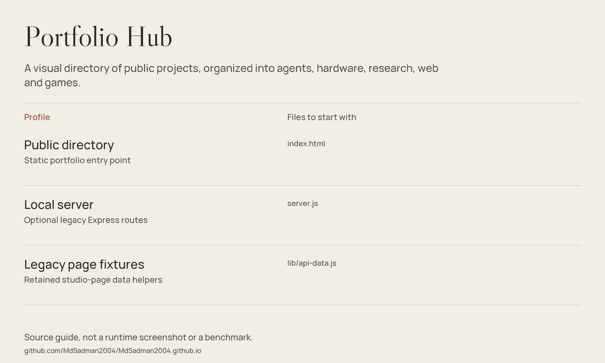

# Portfolio Hub

A visual directory of public projects, organized into agents, hardware, research, web and games.



*Source guide drawn from the files in this repository; not a runtime screenshot or a fresh benchmark.*

## Project directory

**[Visit the portfolio](https://mdsadman2004.github.io/)** · **[GitHub profile](https://github.com/MdSadman2004)**

The static `index.html` presents the current public repositories by category, with project images and direct source links. It is a directory, not a hosted version of every application.

## Getting started

The hub itself needs only a browser or static server:

```bash
git clone https://github.com/MdSadman2004/MdSadman2004.github.io.git
cd MdSadman2004.github.io
python -m http.server 8000 --bind 127.0.0.1
```

Open `http://127.0.0.1:8000/`.

The repository also retains older studio pages, Express routing and Netlify helpers. Those are separate from the static portfolio directory. To inspect that legacy path, use `npm install` and `npm start`; the server defaults to port 8080. The manifest's `npm test` is a placeholder that exits with failure, not a test suite.

## Source guide

| Component | File | Purpose |
| :-- | :-- | :-- |
| Public directory | [index.html](index.html) | Static portfolio entry point |
| Local server | [server.js](server.js) | Optional legacy Express routes |
| Legacy page fixtures | [lib/api-data.js](lib/api-data.js) | Retained studio-page data helpers |

## Scope & limitations

A source link does not assert an application is deployed or production-ready. Source-guide graphics are explanatory drawings, not runtime screenshots. Legacy studio endpoints and example fixtures are not a production CRM. The static directory is redesigned here; project application code, legacy server behavior and deployment workflows remain unchanged.

## Reuse & attribution

No standalone repository-wide license file is included in this checkout. Public source access is not a blanket license grant; check provenance and permissions before redistribution.

Self-hosted Libre Caslon Display and Manrope fonts retain their SIL Open Font License texts in [Caslon-OFL.txt](docs/portfolio/fonts/Caslon-OFL.txt) and [Manrope-OFL.txt](docs/portfolio/fonts/Manrope-OFL.txt), with attribution in [FONT-NOTICES.md](docs/portfolio/FONT-NOTICES.md).
